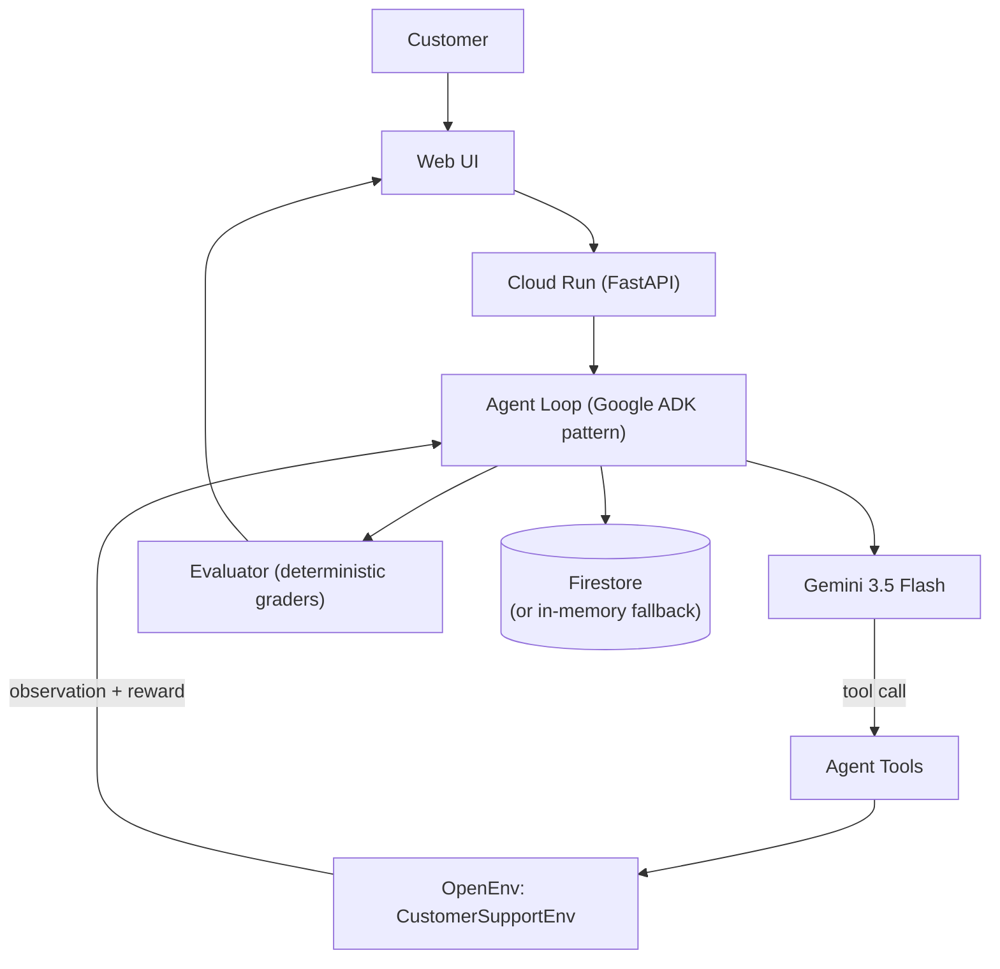

# Customer Support Resolution Agent

An autonomous Gemini agent that resolves customer support tickets end-to-end — built on a real OpenEnv environment, Google's Agent Development Kit (ADK), and designed for deployment to Cloud Run.

## Problem

Customer support automation is a genuinely hard agentic problem: an agent has to read an ambiguous ticket, search internal policy, decide whether a refund is justified, act on that decision, and know when to hand off to a human — all without hallucinating policy or looping on the same action. Most demos fake this with scripted flows. This project evaluates it properly, with a real environment and deterministic grading.

## Solution

This repo pairs a **Gemini 3.5 Flash** agent with a purpose-built **OpenEnv** environment (`env/`) that simulates ticket state, a knowledge base, refunds, and escalation. The agent never talks to the environment directly — it calls tools (`agent/tools.py`), the tools call `env.step(...)`, and the environment returns an observation and a reward. Nothing about resolution success is scripted after the fact: it's graded by the environment's own deterministic graders (`env/graders.py`).

## Why Agentic?

- **Reasoning**: the agent reads ticket + customer context + KB search results and decides what to do next.
- **Planning & multi-step execution**: a ticket typically takes 4–6 tool calls (inspect → search → verify → act → reply → close).
- **Tool selection**: 8 tools are exposed (`agent/tools.py`); the agent chooses which one to call each turn.
- **Environment interaction**: every tool call is a real `env.step()` against OpenEnv — the agent cannot bypass it.
- **Feedback/reward**: the environment returns a reward after each action, which the agent's trace and the evaluation dashboard both surface.
- **Escalation**: the agent can hand off to a human tier-2 agent when a ticket needs judgment beyond its authority.

## Architecture



Google Cloud is used at three points: **Cloud Run** hosts the FastAPI app, **Gemini 3.5 Flash** (via the Gemini Developer API or Vertex AI) powers the agent's reasoning and tool calls, and **Firestore** persists sessions, traces, and evaluation results.

## Features

- Closed-loop autonomous agent: ticket → tool selection → OpenEnv → observation/reward → next action → resolution.
- 8 real tools, each mapped 1:1 onto the environment's action space (no fake tools).
- Safe, chain-of-thought-free action traces ("Searched knowledge base...", "Refund approved...").
- Deterministic oracle fallback when no `GOOGLE_API_KEY` is set, so the project runs and is fully testable with zero Google Cloud setup.
- Firestore persistence with automatic in-memory fallback for local dev.
- REST API with Pydantic request/response models.
- Lightweight, dependency-free web UI (static HTML/CSS/JS, no build step) showing live agent activity, the final customer response, and evaluation metrics.
- 30 pytest tests covering the environment, the tool layer, the ADK agent construction and production loop, the API, and config edge cases — none require a live Gemini call.

## Agent Tools

| Tool | Maps to environment action |
|---|---|
| `get_ticket_state` | reads `env.get_state()` |
| `get_customer_history` | reads `state.customer_context` |
| `verify_policy` | reasons over `state.kb_articles` (no env mutation) |
| `search_knowledge_base` | `Action(action_type="SearchKB")` |
| `issue_refund` | `Action(action_type="IssueRefund")` |
| `escalate_ticket` | `Action(action_type="Escalate")` |
| `respond_to_customer` | `Action(action_type="Reply")` |
| `close_ticket` | `Action(action_type="CloseTicket")` |

## OpenEnv Environment

The original OpenEnv environment (`env/`) is unchanged in behavior:

- **State**: ticket, customer context, KB articles, conversation history, refund/escalation flags, step count.
- **Action space**: `Reply`, `SearchKB`, `IssueRefund`, `Escalate`, `CloseTicket`.
- **Tasks**: Easy (password reset), Medium (defective product, $150 refund), Hard (duplicate billing).
- **Reward**: dense per-step reward (efficiency penalty, KB-search bonus, correct-refund bonus) plus a final grader bonus (0–10) — see `env/reward.py` and `env/graders.py`.
- The original `/reset`, `/step`, `/state/{id}`, `/health` OpenEnv API endpoints are preserved unchanged.

## Evaluation

`agent/evaluator.py` computes, from the actual trace and final environment state (nothing hardcoded per task):

- `resolution_success` — the task's own deterministic grader (0–1)
- `policy_compliance` — fraction of refunds that were preceded by a `verify_policy` check that justified them
- `tool_efficiency` — 1 minus the redundant-action rate
- `reward` — total accumulated environment reward
- `num_actions`, `escalation_rate`, `refund_accuracy`, `resolution_time_seconds`

## Tech Stack

- **Gemini 3.5 Flash** — reasoning model (`google-genai` SDK; works against the Gemini Developer API or Vertex AI)
- **Google Agent Development Kit** — `google-adk` is the production agent framework. `agent/agent.py::build_adk_agent` constructs a real `google.adk.agents.Agent`, run via a real `google.adk.runners.Runner` + `InMemorySessionService` in `_run_adk_loop`. This is the default execution path whenever Gemini credentials are configured. A deterministic oracle path exists only for offline testing and local development without Google Cloud setup (see "Local Development" below) — it is never used in production.
- **Google Cloud Run** — production hosting
- **Google Cloud Firestore** — persistent state (with in-memory fallback)
- **Python 3.11, FastAPI, Pydantic** — API layer
- **OpenEnv** — environment/evaluation spec
- **Vanilla HTML/CSS/JS** — frontend (no build step, served directly by FastAPI)
- **pytest** — test suite

## Local Development

```bash
git clone https://github.com/suyash24-cmd/customer-support-openenv.git
cd customer-support-openenv
python -m venv .venv && source .venv/bin/activate   # Windows: .venv\Scripts\activate
pip install -r requirements.txt

cp .env.example .env
# Fill in GOOGLE_API_KEY for live Gemini reasoning, or leave it blank to
# run the deterministic oracle fallback (no Google Cloud setup needed).

uvicorn server:app --reload --port 8080
```

Open `http://localhost:8080` for the UI, or call the API directly:

```bash
curl -X POST http://localhost:8080/api/agent/resolve \
  -H "Content-Type: application/json" \
  -d '{"task_level": "medium"}'
```

## Environment Variables

See `.env.example` for the full list. Key ones:

| Variable | Purpose |
|---|---|
| `GOOGLE_API_KEY` | Gemini Developer API key. Omit to run the deterministic fallback. |
| `GOOGLE_GENAI_USE_VERTEXAI` | Set `true` to route through Vertex AI instead. |
| `GOOGLE_CLOUD_PROJECT` / `GOOGLE_CLOUD_LOCATION` | Required for Vertex AI mode and Firestore. |
| `GEMINI_MODEL` | Defaults to `gemini-3.5-flash`. |
| `USE_FIRESTORE` | `true` to persist to Firestore; otherwise uses an in-memory store. |
| `PORT` | Set automatically by Cloud Run; defaults to `8080` locally. |

## Running Tests

```bash
pytest -v
```

30 tests, all runnable offline — Gemini and Firestore calls are never made in the test suite (see `tests/conftest.py`, which unsets `GOOGLE_API_KEY` and forces `USE_FIRESTORE=false`).

## Docker

```bash
docker build -t customer-support-agent .
docker run -p 8080:8080 --env-file .env customer-support-agent
```

## Google Cloud Deployment

```bash
# 1. Authenticate and select a project
gcloud auth login
gcloud config set project YOUR_PROJECT_ID

# 2. Enable required APIs
gcloud services enable run.googleapis.com \
    cloudbuild.googleapis.com \
    firestore.googleapis.com \
    aiplatform.googleapis.com

# 3. (One-time) create a Firestore database in Native mode
gcloud firestore databases create --location=us-central1

# 4. Store your Gemini API key as a secret (never commit it)
echo -n "YOUR_GEMINI_API_KEY" | gcloud secrets create gemini-api-key --data-file=-

# 5. Build and deploy via Cloud Build (uses cloudbuild.yaml)
gcloud builds submit --config cloudbuild.yaml

# 6. Attach the secret as an env var on the deployed service
gcloud run services update customer-support-agent \
    --region=us-central1 \
    --update-secrets=GOOGLE_API_KEY=gemini-api-key:latest
```

`cloudbuild.yaml` builds the container, pushes it to Container Registry, and deploys it to Cloud Run with `USE_FIRESTORE=true`. The Gemini API key is attached separately via Secret Manager (step 6) rather than baked into `cloudbuild.yaml`, so it's never stored in source control or build logs.

## API Documentation

| Endpoint | Description |
|---|---|
| `GET /health` | Health check — `{"status": "ok"}` |
| `POST /reset` | OpenEnv: reset an environment session |
| `POST /step` | OpenEnv: step an environment session with an `Action` |
| `GET /state/{session_id}` | OpenEnv: raw environment state |
| `POST /api/agent/resolve` | Run the full autonomous agent loop on a new ticket |
| `GET /api/agent/session/{session_id}` | Full persisted session (ticket, history, actions, refund, metrics) |
| `GET /api/agent/trace/{session_id}` | Just the agent's action trace |
| `GET /api/agent/evaluation/{session_id}` | Just the evaluation metrics |
| `GET /api/agent/sessions` | List all known session IDs |

Example `/api/agent/resolve` response:

```json
{
  "session_id": "b2e1...",
  "status": "resolved",
  "final_response": "I've issued a full $150 refund for your defective router.",
  "reward": 10.4,
  "metrics": {
    "resolution_success": 1.0,
    "policy_compliance": 1.0,
    "tool_efficiency": 1.0,
    "reward": 10.4,
    "num_actions": 6,
    "escalation_rate": 0.0,
    "refund_accuracy": 1.0
  },
  "actions": [ "..." ],
  "execution_path": "adk"
}
```

## Demo

1. Open the UI, pick a scenario (Easy / Medium / Hard).
2. Click **Resolve Ticket** — the agent runs its full tool-calling loop live.
3. Watch the Agent Activity panel populate with each tool call and its reward.
4. Read the final customer-facing response and the evaluation metrics.

## Project Structure

```
customer-support-openenv/
├── agent/            # Google ADK agent (production) + Gemini model
│   ├── agent.py      # build_adk_agent() + ADK Runner loop (production); deterministic fallback for offline/local dev
│   ├── tools.py      # tool declarations + ToolExecutor (wraps env.step)
│   ├── prompts.py    # system prompt
│   └── evaluator.py  # metrics from real trace + environment state
├── env/              # original OpenEnv environment (unchanged behavior)
│   ├── environment.py, models.py, reward.py, graders.py, tasks.py
├── storage/
│   └── firestore.py  # Firestore persistence + in-memory fallback
├── frontend/dist/    # static HTML/CSS/JS UI (no build step)
├── tests/            # 30 pytest tests
├── server.py         # FastAPI app: OpenEnv + agent endpoints
├── inference.py      # OpenEnv-required baseline entrypoint (now Gemini-based)
├── scripts/run_baseline.py
├── Dockerfile
├── cloudbuild.yaml
└── openenv.yaml
```

## Future Improvements

- Swap the static frontend for a React + Vite build if richer interactivity is needed.
- Add streaming tool-call traces over WebSocket/SSE instead of a single blocking `/api/agent/resolve` call.
- Multi-turn conversations (the current loop resolves a ticket in one call; a chat-style follow-up endpoint would let a human intervene mid-resolution).

## Hackathon Compliance

| Requirement | Where it's satisfied |
|---|---|
| Gemini 3.5+ | `agent/agent.py::_run_adk_loop`, model `gemini-3.5-flash` (configurable via `GEMINI_MODEL`), set on the ADK `Agent` |
| Google Agent Development Kit (ADK) | `google-adk` is the production agent framework: `agent/agent.py::build_adk_agent` constructs a real `google.adk.agents.Agent`, executed via a real `google.adk.runners.Runner` + `InMemorySessionService` in `_run_adk_loop` — this is the default path whenever Gemini credentials are configured |
| Real ADK Agent | `build_adk_agent()` returns a genuine `google.adk.agents.Agent` instance (not a mock) with all 8 tools registered with real, introspectable JSON schemas |
| Real ADK Runner | `_run_adk_loop()` drives the agent through a genuine `google.adk.runners.Runner`; verified via a mocked-`Runner.run` test that confirms the production code path executes (`tests/test_agent.py::test_run_ticket_uses_real_adk_runner_as_production_path`) |
| 8 agent tools | `get_ticket_state`, `get_customer_history`, `verify_policy`, `search_knowledge_base`, `issue_refund`, `escalate_ticket`, `respond_to_customer`, `close_ticket` — each a real Python function delegating to `ToolExecutor` → `CustomerSupportEnv.step()` |
| Google Cloud deployment | `Dockerfile` (Cloud Run `$PORT` compliant), `cloudbuild.yaml` — deployment is implemented and documented below but not yet executed against a live GCP project |
| Autonomous multi-step agent behavior | `agent/agent.py::_run_adk_loop` — ADK Runner loop, up to `MAX_ADK_TURNS` top-level turns, with Gemini making multiple tool calls per turn |
| Tool calling | `agent/tools.py` (`ToolExecutor`) + `agent/agent.py::build_adk_agent` — 8 tools, each with a real ADK-introspectable schema |
| Persistent state | `storage/firestore.py` — Firestore-backed when `USE_FIRESTORE=true`, in-memory fallback otherwise |
| OpenEnv-based environment/evaluation | `env/` (unchanged), `openenv.yaml` |
| Reward/evaluation metrics | `env/reward.py`, `env/graders.py`, `agent/evaluator.py` — all metrics computed from real trace/environment state, nothing hardcoded |
| Professional web UI | `frontend/dist/` |
| Reproducible deployment | "Google Cloud Deployment" section above |
| Professional GitHub repository | `.gitignore`, `.env.example`, 30 pytest tests, this README |

**Honesty note**: `GOOGLE_API_KEY` / a Google Cloud project / billing / Firestore provisioning are required to exercise the *live* Gemini + ADK Runner path and real Firestore — those cannot be exercised from a sandboxed build environment with no network access to Google's APIs. What has been verified without those credentials: `build_adk_agent()` constructs a real `google.adk.agents.Agent` with correct, introspectable tool schemas for all 8 tools (see `tests/test_agent.py`); a mocked `Runner.run()` test proves `run_ticket()` genuinely routes through the ADK Runner and that each tool call mutates the real `CustomerSupportEnv`; and the separate deterministic fallback path (used only when no credentials are present) exercises the same `ToolExecutor`/OpenEnv/evaluator code end-to-end. The one thing not exercised here is an actual network call to the Gemini API itself.
